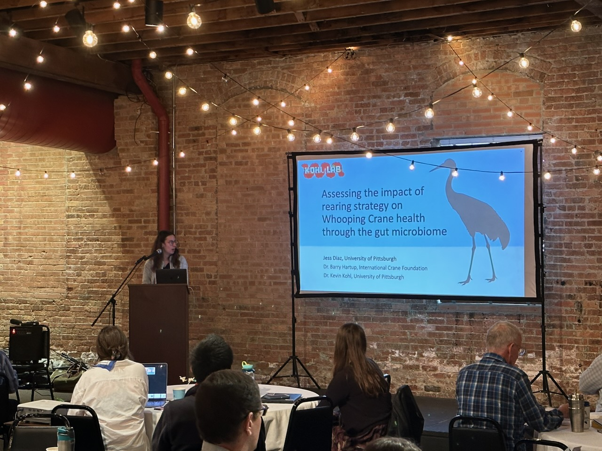
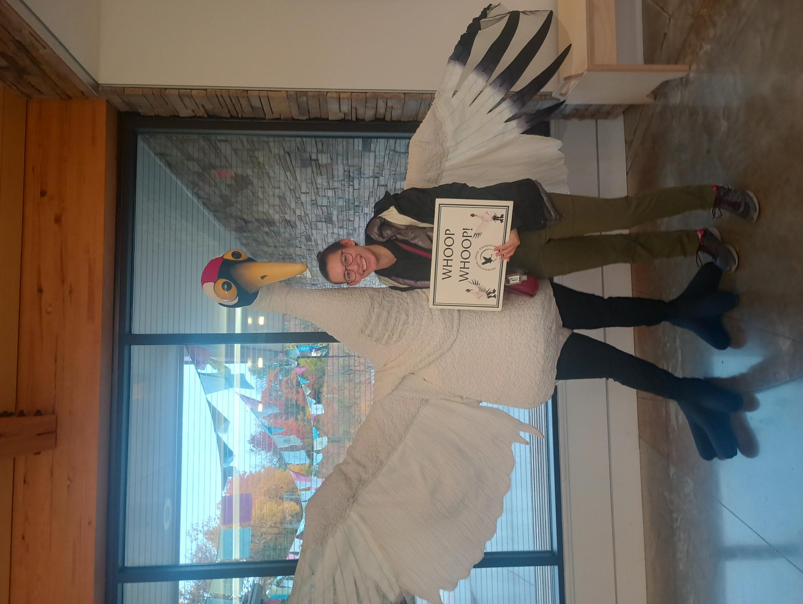
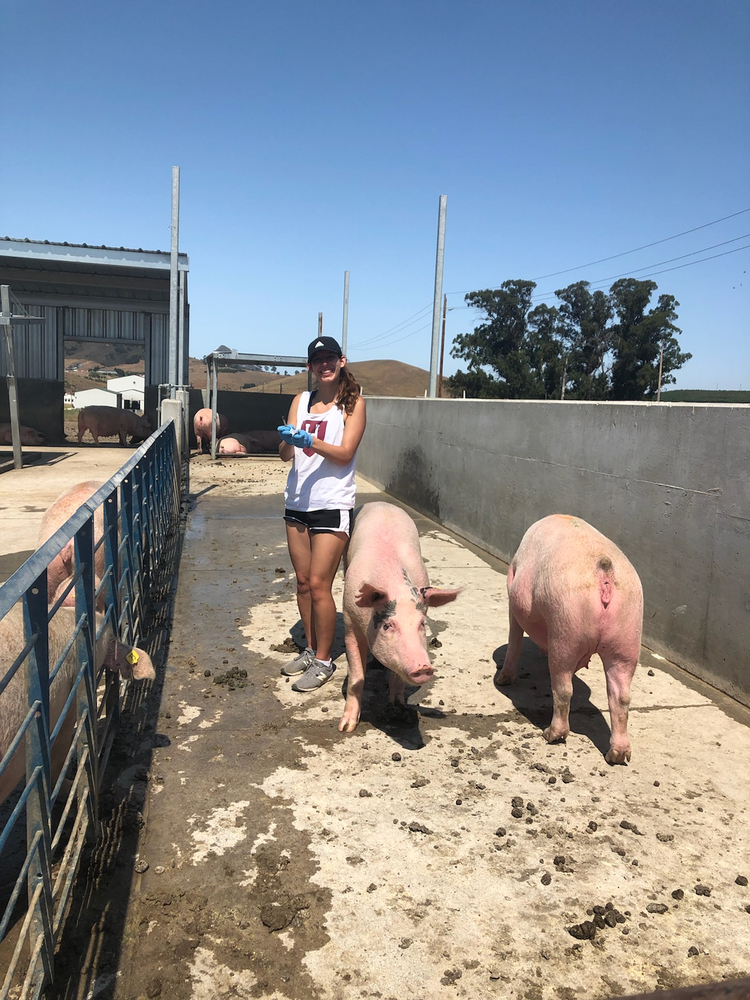

Following my undergraduate research on the human microbiome, I developed an interest in studying non-human animals. Specifically, I became fascinated by the question of what happens to the microbiomes of animals when taken into human care. Microbiome composition is deeply tied to environment, and the environments of animals in captive spaces are fundamentally different from those of wild animals, in a way that could have implications for animal health. A casual curiosity turned into a full literature review, [published in 2021 in the journal *Animal Microbiome*](https://link.springer.com/article/10.1186/s42523-021-00155-8).

Since that review, I have led several projects tackling different questions about the "captive" microbiome.

1.  As part of my PhD in the [Kohl Lab](https://www.kohl-lab.com/) at the University of Pittsburgh, I am exploring the effect of rearing strategy (parent and hand rearing) on the gut microbes of captive-bred Whooping Cranes. I have presented this work at several conferences, including the 2023 North American Crane Workshop in Baraboo WI and at the 2025 Society for Integrative and Comparative Biology Conference in Atlanta GA. This work is being prepared for publication.

    {fig-align="left" width="450"}

    {fig-align="left" width="450"}

2.  In the Reese Lab at UCSD (Dept of Ecology, Behavior and Evolution), I led a project in which we compared the gut microbiomes of deer mice from free-living and captive environments, including both urban and non-urban wild mice as well as captive mice from different types of institutions (zoo and laboratory). Overall, we found that wild mice had distinct gut microbiomes from both captive mice and from free-living urban mice. [This work was published in 2023 in *Biology Letters*](https://royalsocietypublishing.org/rsbl/article/19/3/20220547/63264/Captive-and-urban-environments-are-associated-with)*.*

3.  In the Reese Lab at UCSD, I aided Sahana Kuthyar with her graduate research studying the impact of domestication on the gut microbiome, using both observational and experimental techniques. As part of this work, we traveled around California collecting pig fecal material and constructed a functioning anaerobic mini-bioreactor system. [This work was published in 2023 in the Journal of Evolutionary Biology](https://academic.oup.com/jeb/article/36/12/1695/7577280).

    {fig-align="left" width="450"}
