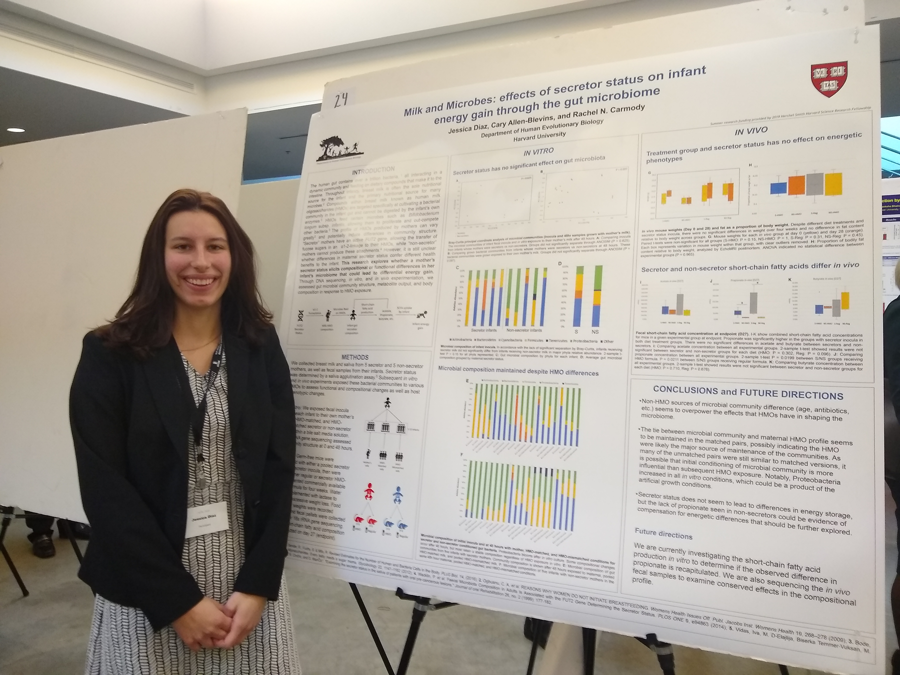

As an undergraduate, I worked with Cary Allen-Blevins in the [Carmody Lab](https://nme.fas.harvard.edu/index.html) at Harvard studying the relationship between maternal milk profiles and infant microbiomes. This work culminated in a senior thesis titled "Milk and Microbes: Effects of secretor status on infant energy gain through the gut microbiome," and I presented this work at the National Collegiate Research Conference held at Harvard in 2020. This work has not yet been published.

This project helped me develop multiple skills, including:

-   IRB-regulated participant recruitment of mothers and infants
-   Microbiome extraction, PCR, and analysis
-   Short-chain fatty acid analysis using HPLC
-   Experimental design of rodent gnotobiotic studies
-   Rodent body composition measurements through Echo-MRI

{fig-alt="Picture of Jess in front of a poster of her research" fig-align="left" width="450"}
